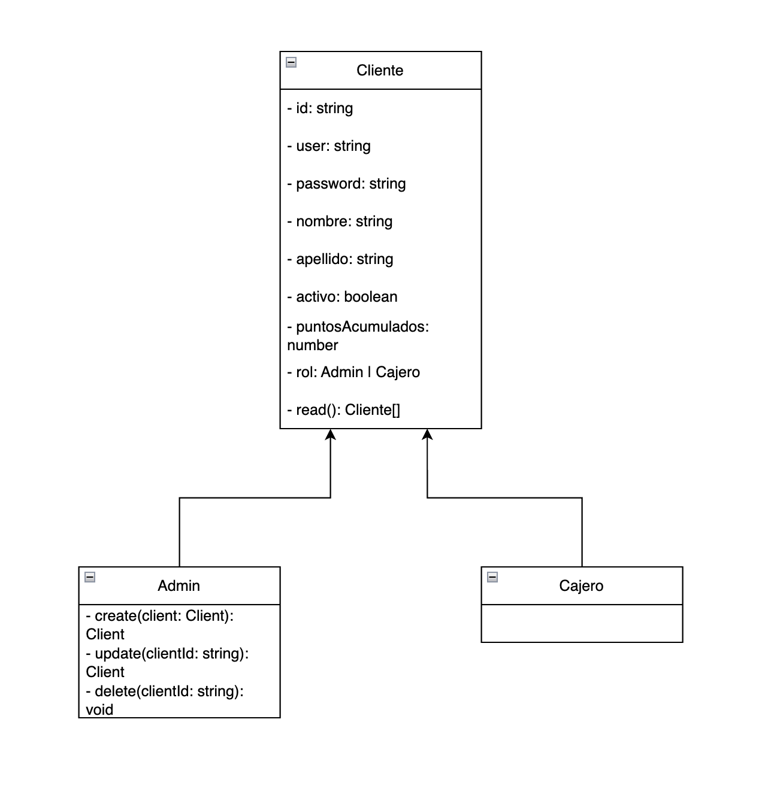
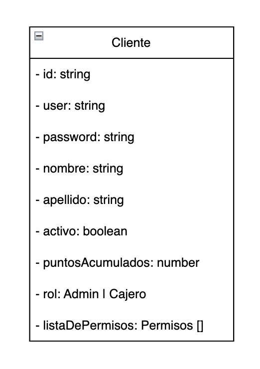
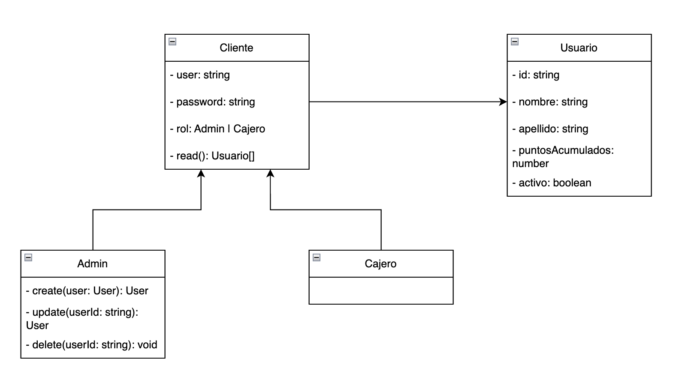
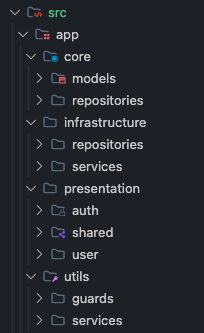
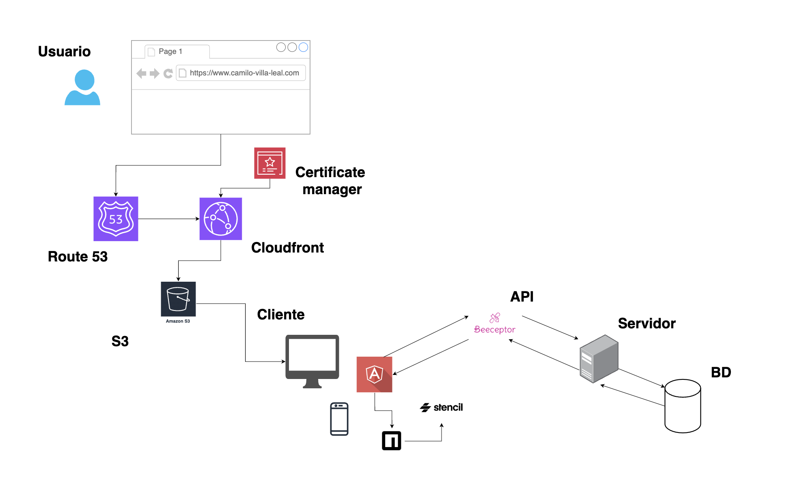
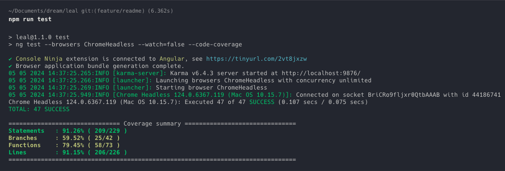

# Leal

Puedes ingresar a la solución por medio de: [camilo-villa-leal.com](https://camilo-villa-leal.com)

## Antes de empezar... solucionemos asuntos pendientes 🚀

Durante mi primer acercamiento con Juan Ca tuve la oportunidad de contarle mi experiencia como desarrollador front-end. Estuvimos hablando durante unos minutos y pude mostrarle todo lo que he aprendido en los últimos años... sin embargo, hubo una serie de preguntas que desconocía o que por nervios dejé pasar. Así que me puse en la tarea de solucionar estos asuntos pendientes y demostrar mis ganas de aprender y mejorar día a día. Así será desde el día 0. 🤝🏼

### DNS (Domain Name System)

Es un sistema de nombres de dominio, el cual se asemeja a un directorio telefónico, donde tenemos un nombre para cada teléfono, en internet tenemos un nombre para cada IP.

El DNS traduce los nombres de dominio a direcciones IP para que los navegadores puedan cargar los recursos de Internet.

DE HECHO, UTILICÉ UN DNS PARA ESTA PRUEBA! 💣

Fuente: https://www.cloudflare.com/es-es/learning/dns/what-is-dns/

### V8

Chrome V8 es un motor de JavaScript, lo que significa que ejecuta código JavaScript. Originalmente, se escribió JavaScript para ser ejecutado por los navegadores web. Chrome V8, o simplemente V8, puede ejecutar código JavaScript tanto dentro como fuera de un navegador, lo que hace posible el scripting por parte del servidor.

Como un motor de coche V8 (de ocho cilindros), Chrome V8 es rápido y potente. V8 traduce el código JavaScript directamente a código máquina\* para que los ordenadores puedan entenderlo, y luego ejecuta el código traducido, o compilado. V8 también optimiza la ejecución de JavaScript.

Fuente: https://www.cloudflare.com/es-es/learning/serverless/glossary/what-is-chrome-v8/

### ¿Cómo funciona un browser?

Un browser es un software que permite a los usuarios acceder al contenido que hay en la web. Su función principal es localizar y cargar el contenido de las páginas webs, así como imágenes, vídeos, documentos y otros archivos que están almacenados en un servidor.

De esta manera, el browser se encarga de enviar una petición a un servidor por medio de protocolos como HTTP op HTTPS. Cuando obtenemos respuesta a esa petición, el trabajo del browser es interpretar el código y mostrarlo de manera que lo podamos consumir.

En pocas palabras, el browser funciona como un puente entre el usuario y los datos almacenados en los servidores.

Fuente: https://www.browserstack.com/guide/what-is-browser

## Una vez solucionado los asuntos pendientes y las preguntas que no pude responder de manera adecuada, voy a mostrarles el desarrollo realizado durante los últimos días...

### 🧍🏻‍♀️🧍🏻‍♂️ Modelo de dominio

Durante la etapa de planeación, encontré tres posibles soluciones frente al posible diseño del modelo de dominio.

#### Propuesta #1

Se identificó una entidad Cliente, la cual cuenta con las siguientes propiedades: id, usuario, contraseña, nombre, apellido, activo, puntos acumulados y rol, además cuenta con la capacidad de leer los datos de todos los usuarios.

A partir de la entidad Cliente, se identicó dos tipos de roles, Admin y Cajero, los cuales heredan todas las propiedades del Cliente.

#### Propuesta #2

Se identificó una entidad Cliente, la cual cuenta con las siguientes propiedades: id, usuario, contraseña, nombre, apellido, activo, puntos acumulados, rol y lista de permisos, los cuales pueden ser: Leer, crear, actualizar o eliminar usuarios.

#### Propuesta 3

Se identificaron 2 entidades, Usuario y Cliente.

El cliente tiene la capacidad de ingresar a la plataforma y realizar un conjunto de acciones dependiendo de su rol.

Si el cliente es de tipo Admin, el cliente podrá crear, leer, actualizar y eliminar datos de un usuario.

Si el cliente es de tipo Cajero, el cliente solo podrá leer los datos del usuario.

Ambos cuentan con usuario y contraseña para ingresar a la aplicación.

Por otro lado tenemos al usuario, esta entidad cuenta con varias propiedades, entre ellas el id, nombre, apellido, puntos acumulados y si está activo o no.

### ⬡ Arquitectura hexagonal

El objetivo principal de la arquitectura hexagonal es separar nuestra aplicación en distintas capas o regiones con su propia responsabilidad. De esta manera se consigue desacoplar capas de nuestra aplicación permitiendo que evolucionen de manera aislada. Además, tener el sistema separado por responsabilidades nos facilitará la reutilización.

De esta manera se organizó el proyecto, de forma que si algún día tenemos un nuevo sistema para el consumo CRUD de los usuarios lo podemos añadir sin modificar el código base. Si deseamos implementar un sistema más riguroso para la autenticación de los usuarios, también podríamos añadir un nuevo servicio con la nueva implementación sin afectar el código previamente realizado.

Tenemos la aplicación separada en 4 grandes regiones

#### 🗂️ Core

En este directorio se define los modelos y la lógica de negocio, la cuál es agnóstica a la implementación y a las tecnologías.

#### 🗂️ Infrastructure

En este directorio se define la implementación de la lógica de negocio con la tecnología ya definida, sin embargo, si deseamos añadir una nueva implementación se puede hacer sin necesidad de afectar el modelo de dominio y el código previamente escrito.

#### 🗂️ Presentation

En este directorio se define los módulos de la vista que se le muestran al usuario, componentes, páginas, etc. y hacen uso de los servicios que definimos en la capa de Infrastructure.

#### 🗂️ Utils

En este directorio se definen funciones que usaremos en toda la aplicación, son métodos de soporte que nos permiten realizar una acción en específico, por ejemplo los guards.

### 💡 Solución planteada

Para la solución al problema planteado, se eligieron varias tecnologías como AWS, Angular y una API para el manejo de los request.

Como el diagrama lo indica, el usuario ingresa a la aplicación por medio de [camilo-villa-leal.com](https://camilo-villa-leal.com). Esto gracias al servicio de AWS Route 53, el cual cuenta con un DNS que nos permite redireccionar a la aplicación almacenada en Cloudfront, otro servicio de AWS que nos permite tener un grupo de servidores distribuidos en diferentes ubicaciones geográficas de todo el mundo para permitir la entrega rápida del contenido del sitio web. También se puede apreciar que el sitio es seguro, de manera que se utilizó el servicio de manejo de certificaciones en AWS, de forma que podemos realizar peticiones bajo el protocolo HTTPS. Cloudfront usa el contenido almacenado en S3, otro servicio de AWS que sirve para guardar información, en este caso el distribuido generado por Angular.

La aplicación fue desarrollada en Angular junto con Stenciljs, así es, por medio de npm se carga un proyecto de componentes web realizados en Stenciljs, los cuales pueden ser usados por cualquier proyecto que consuma esta librería de NPM y consume una API llamada Beeceptor, la cual cuenta con varias funcionalidades y una de ella es un sistema CRUD para usuarios, estas funciones se realizan bajo un servidor externo y luego esos datos son almacenados en una base de datos.

### ✅ Tests

Se realizó un total de 47 tests unitarios, donde se testeó componentes, servicios y guards. El resultado fue de un 91% de statements alcanzados y un 91% de líneas de código alcanzadas.

